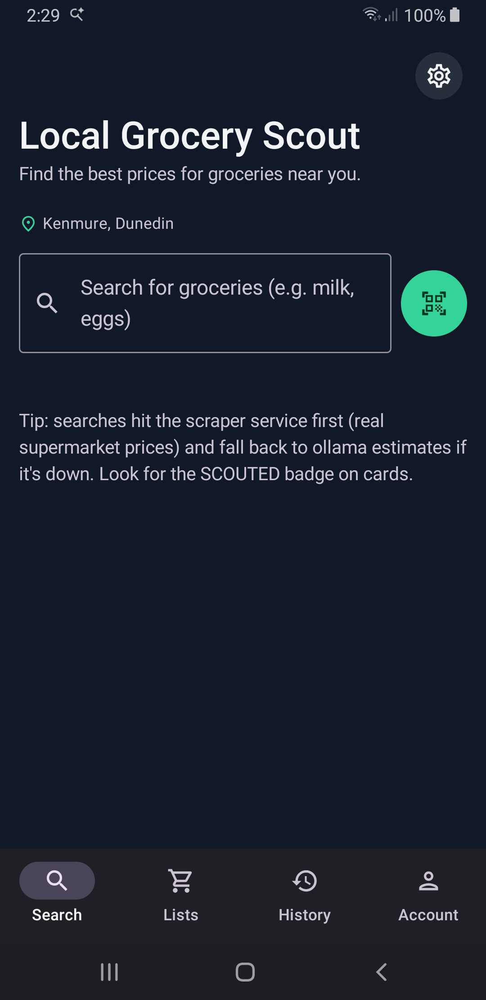
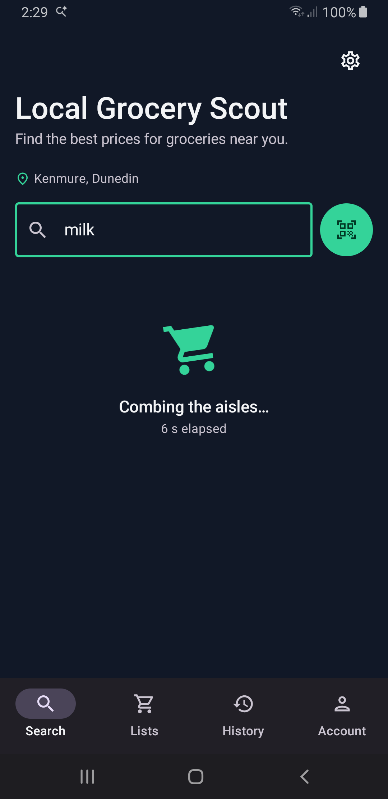
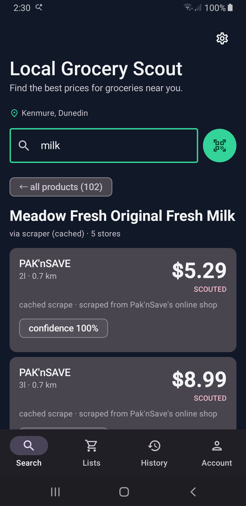
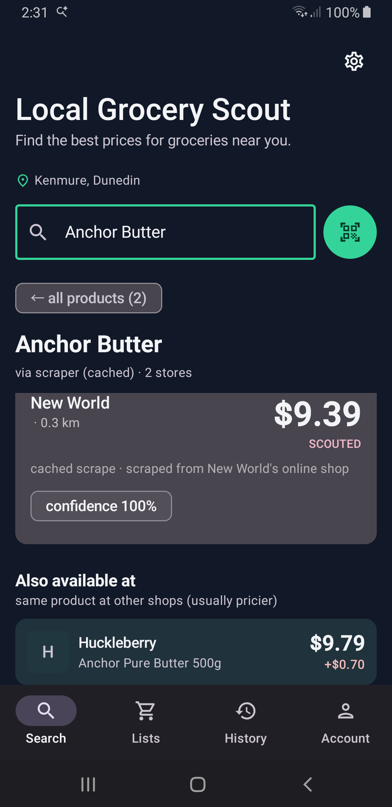
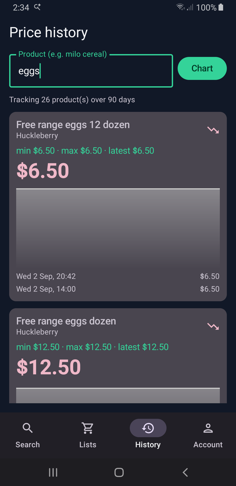
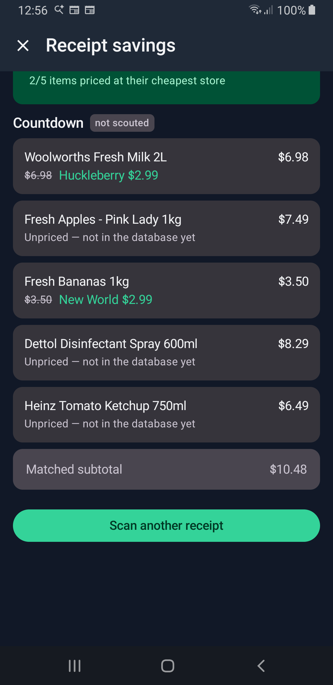

# 🛒 Local Grocery Scout

**Know what your groceries cost before you walk in the door.**

Local Grocery Scout is a native Android app that tells you what your weekly shop actually costs — across New Zealand's biggest supermarket chains, with real scraped prices, not ads or sponsored listings. Search a product, see every store that sells it, and let the app point you at the cheapest one. It even tells you when the *same exact product* hides under a different name somewhere else for less.

<div align="center">

| | | |
|:---:|:---:|:---:|
|  |  |  |
| *Detected location + instant search* | *102 milk products, tap to compare* | *Cheapest store, confidence, distance* |

| | |
|:---:|:---:|
|  |  |
| *Same butter, $0.70 cheaper next door* | *Every search builds the price database* |

| |
|:---:|
|  |
| *A real receipt, scanned: 2 items priced, honest savings, 3 items honestly unpriced* |

</div>

## Why

NZ groceries are expensive and opaque. The same basket can swing **tens of dollars** depending on where you shop — but comparing means keeping five supermarket apps or tabs open and playing spot-the-difference with product names that all differ ("Anchor Butter" vs "Anchor Pure Butter 500g" vs "Butter Salted 500g").

Local Grocery Scout does that comparison for you:

- 📷 **Scan any barcode** — the product is identified via [Open Food Facts](https://openfoodfacts.org) and priced instantly. No typing.
- 🔍 **Search like a human** — type "milk" and get every fresh milk across every connected store, each with its cheapest price.
- 🥇 **See the cheapest store first** — big price, store name, distance from you, and how confident the match is.
- 🏪 **Spot the renamed identical product** — the cross-chain matcher recognises that "Anchor Pure Butter 500g" at one chain is the same block of butter another chain sells as "Anchor Butter" — and tells you the price difference.
- 📈 **Watch prices over time** — every search feeds a growing price database (currently **~9,800 historical datapoints** across 3,400+ products), so charts show what prices are really doing.
- 📍 **Know what's near you** — your detected area shows right on the home screen; store cards show how far the shop is.

## How it works

```
┌─────────────┐   HTTP    ┌──────────────────────────────┐
│  Android app │ ───────▶ │  Price scraper (FastAPI)     │
│  (Kotlin +   │          │  ├─ New World (Playwright)   │
│   Compose)   │          │  ├─ Pak'nSave (__NEXT_DATA__)│
└─────────────┘           │  └─ The Warehouse (catalog)  │
       ▼                  │  └─ SQLite price database    │
┌─────────────┐           └──────────────────────────────┘
│ Open Food    │
│ Facts (bars) │      Prices are SCRAPED, never guessed.
└─────────────┘       Every result is labelled with its source.
```

The phone app is a thin, fast client over a price service that does the hard work:

- **Four scraping chains**, each with a technique tuned to that site's stack — Playwright rendering, `__NEXT_DATA__` extraction, Shopify JSON endpoints, sitemap→JSON-LD catalog sweeps.
- **A local price database** (SQLite) — 3,600+ live prices, ~9,800 history points, 40 stores, refreshed by scheduled scrapes twice a day.
- **LLM-powered matching, locally hosted** — an LLM resolves messy product listings to your query, and a second LLM pass matches the *same product* across chains even when the names differ. Falls back to a smaller on-GPU model automatically if the primary is down.
- **Honest results** — every price card shows whether it was **SCOUTED** (real scraped price) with a confidence level. No estimates dressed up as facts.

## Feature tour

### 🔍 Two-step search that actually finds things
Type a query → a picker shows *every matching product* with photo, store count, and cheapest price. Tap one → full price breakdown. No more guessing the exact product name a supermarket's search expects.

### 📷 Barcode scanning
Green button → point at any barcode → ML Kit detects it, Open Food Facts names it, the price service finds it across stores, and you're one tap from scouting its price.

### 🧾 Receipt-to-savings
Photograph your receipt when you get home and see what you *could have* paid: every line item is read (OCR + local vision model), matched against the price database, and priced at its cheapest scouted store — with a big **"You could have saved $X"** banner and per-item strikethrough deltas. Items we can't confidently identify show honestly as **unpriced** and never count toward the savings. Receipts from unscouted chains (Woolworths/Countdown) work too — you just can't price items *at* that store yet.

### 🏪 "Also available at"
The killer feature for real grocery shopping: after the main price cards, the app lists where the **same product** is sold under a **different name**, with a red **+$X** / green **−$X** delta against the cheapest. Matching is brand-and-pack-size strict — 750g Weet-Bix is never compared to 1.2kg Weet-Bix.

### 📈 Price history
Every search and scheduled scrape adds dated datapoints. Type a product on the History tab to chart its price movement over 90 days.

### 📍 Location-aware
Grant location once and the app detects your area (e.g. "Kenmore, Dunedin") and sorts stores by real distance.

## The stack

**Android app** — Kotlin 2.1, Jetpack Compose, Material 3 (dynamic color), Hilt, Retrofit + kotlinx.serialization, CameraX + ML Kit, Fused Location Provider, DataStore. Material You theming out of the box.

**Price scraper** — Python 3, FastAPI + uvicorn, SQLite, Playwright (New World), direct-site extractors for Pak'nSave/The Warehouse, local LLM via [Ollama](https://ollama.com) for product matching.

### Running your own

```bash
# 1. The scraper (any machine on your LAN)
cd scraper
pip install fastapi uvicorn playwright
python -m playwright install chromium
uvicorn api:app --host 0.0.0.0 --port 8300

# 2. The app — open in Android Studio, set the scraper host in
#    Settings inside the app, build & run.
./gradlew assembleDebug
```

Set the scraper address in the app under **Settings**. An Ollama host can also be configured there for on-device-adjacent LLM matching; without one, exact-name matching still works.

## Privacy

- **No telemetry. No analytics. No tracking SDKs.** The app talks to exactly two things: your price scraper and Open Food Facts.
- Location is used only to compute store distances; it never leaves your device — the address label is resolved on the phone.
- Cleartext HTTP is whitelisted only for private LAN ranges, because the scraper is *your* server on *your* network.
- All price data lives in your own SQLite file.

## Status

Working today: search, two-step product picker with photos, barcode scanning, receipt-to-savings, cross-chain "also available at" comparison, price history charts, detected location, twice-daily scheduled scrapes, resilient LLM fallback (cloud model → local GPU model).

Roadmap: shopping-list totals with per-store splitting, price-drop alerts, more chains (Countdown is the big one — it would light up receipt savings for NZ's biggest chain), receipt savings history, and sharing lists between households.

## License

MIT — same as the upstream [Local Grocery Scout web app](https://github.com/andres-villavicencio-dev/LocalGroceryScout).